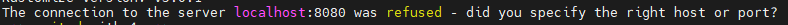

# **Installation Kubernetes**

## 1 - Installation classique Ubuntu Server 20.04 LTS

-> Ne pas préinstaller kubernetes avec k8s

## 2 - Installation de docker

```bash
apt-get update
apt-get upgrade
apt install curl

#Script d'installation automatique de docker
curl -sSL https://get.docker.com/ | CHANNEL=stable bash
```

## 3 - Installation de kubernetes

```bash
#Vérifier que docker tourne et est en version supprérieur à 19
docker --version

#Ajout de la clé GPG et du repo
curl -fsSLo /etc/apt/keyrings/kubernetes-archive-keyring.gpg https://packages.cloud.google.com/apt/doc/apt-key.gpg
echo "deb [signed-by=/etc/apt/keyrings/kubernetes-archive-keyring.gpg] https://apt.kubernetes.io/ kubernetes-xenial main" | sudo tee /etc/apt/sources.list.d/kubernetes.list
```

```bash
#Installation de Kubernetes
apt-get update
apt-get install -y kubelet kubeadm kubectl
apt-mark hold kubelet kubeadm kubectl

#Vérification que kube tourne
kubectl version --short
```



Si cette erreur ne s'affiche rien de grave cela veut juste dire qu'aucun noeud Kubernetes est joiniable

## 4 - Etape 1 - Creation d'un noeud Kubernetes

Changement du Hostname (On peux choisir ce que l'on veux)

```bash
# Si l'hote est un node Master
hostnamectl set-hostname kubernetes-master
# Si l'hote est un node Worker
hostnamectl set-hostname kubernetes-worker
```

Activation du module de bridge pour la liaison de noeud

```bash
sudo modprobe br_netfilter
sudo sysctl net.bridge.bridge-nf-call-iptables=1
```

Par défaut docker utilisé "cgroupfs", l'une des préconisations de kebernetes est d'utiliser "système

```bash
mkdir /etc/docker
cat <<EOF | sudo tee /etc/docker/daemon.json
{ "exec-opts": ["native.cgroupdriver=systemd"],
"log-driver": "json-file",
"log-opts":
{ "max-size": "100m" },
"storage-driver": "overlay2"
}
EOF
```

Restart des services docker

```bash
sudo systemctl enable docker
sudo systemctl daemon-reload
sudo systemctl restart docker
```

## 4 - Etape 2 - Creation d'un noeud Kubernetes

Desactivation de la mémoire Swap

```bash
sudo swapoff -a
sudo nano /etc/fstab
```
Commenter la ligne du volume swap afin qu'après un reboot il ne se remonte pas


Ajout d'un pod (le réseaux de communication entre les noeuds kubernetes peux être changer dans la commande ci-dessous)

```bash
kubeadm init --pod-network-cidr=10.244.0.0/16
```

- Si erreur de containerd faire :

```bash
cat > /etc/containerd/config.toml <<EOF
[plugins."io.containerd.grpc.v1.cri"]
  systemd_cgroup = true
EOF
systemctl restart containerd
```

Faire les commandes suivantes afin de sauvegarde de manière persistante les configurations

```bash
mkdir -p $HOME/.kube
sudo cp -i /etc/kubernetes/admin.conf $HOME/.kube/config
sudo chown $(id -u):$(id -g) $HOME/.kube/config
```

## 5 - Installation du Web GUI

Cette interface n'est pas fait pour faire la configuration mais pour la maintenance ou le monitoring de pod (noeud) ou de container

```bash
kubectl apply -f https://raw.githubusercontent.com/kubernetes/dashboard/v2.7.0/aio/deploy/recommended.yaml
```

Creation d'un compte admin

```bash
nano dash-admin.yaml
```
Mettre le contenu suivant :
```yaml
apiVersion: v1
kind: ServiceAccount
metadata:
  name: dash-admin
  namespace: kube-system
---
apiVersion: rbac.authorization.k8s.io/v1
kind: ClusterRoleBinding
metadata:
  name: dash-admin
roleRef:
  apiGroup: rbac.authorization.k8s.io
  kind: ClusterRole
  name: cluster-admin
subjects:
- kind: ServiceAccount
  name: dash-admin
  namespace: kube-system

```

```bash
#Commande pour appliquer le fichier
kubectl apply -f dash-cat admin.yaml
```

Creation d'un token

```bash
nano dash-admin-sa-token.yaml
```
Mettre le contenu suivant :
```yaml

apiVersion: v1
kind: Secret
metadata:
  name: dash-admin-sa-token
  namespace: kube-system
  annotations:
   kubernetes.io/service-account.name: dash-admin
type: kubernetes.io/service-account-token

```

```bash
#Commande pour appliquer le fichier
kubectl apply -f dash-admin-sa-token.yaml
```

Pour afficher le token

```bash
kubectl describe secrets dash-admin-sa-token -n kube-system
```

## 6 - Connexion Web GUI

Le dashboard kubernetes par défaut est accessible uniquement en local host d'où la nécessiter de faire un tunnel ssh

Creation d'un tunnel

```bash
ssh -g -L 8001:localhost:8001 -f -N root@<IP_VM>
```

Normalement le dashboard est maintenant accessible à l'adresse suivante :

<http://localhost:8001/api/v1/namespaces/kubernetes-dashboard/services/https:kubernetes-dashboard:/proxy/>

Fait par Thibaut Lulinski